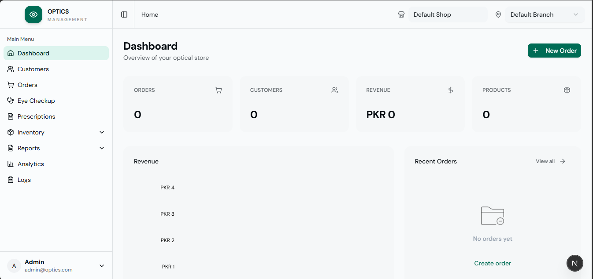
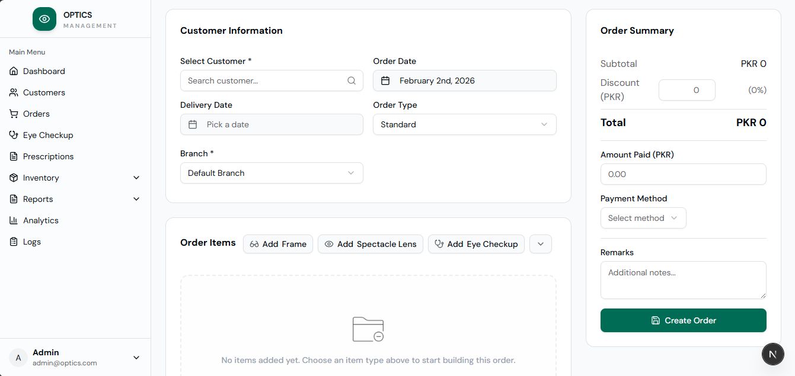
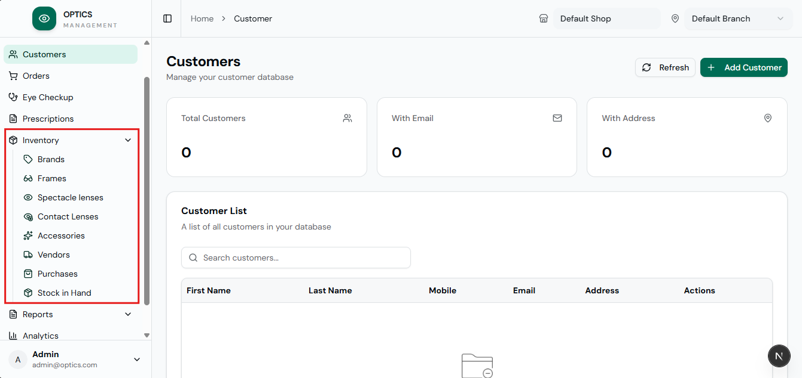
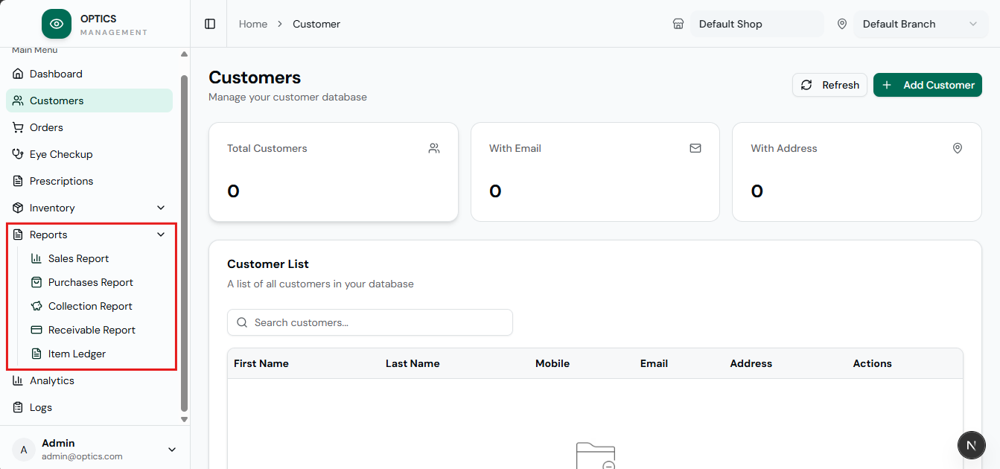
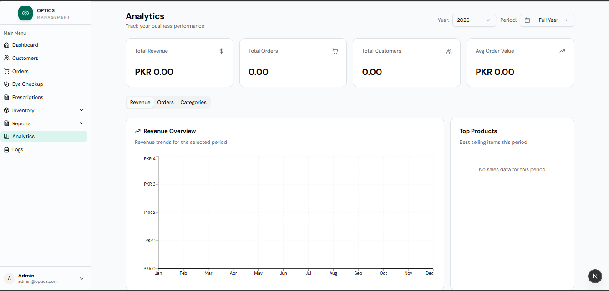
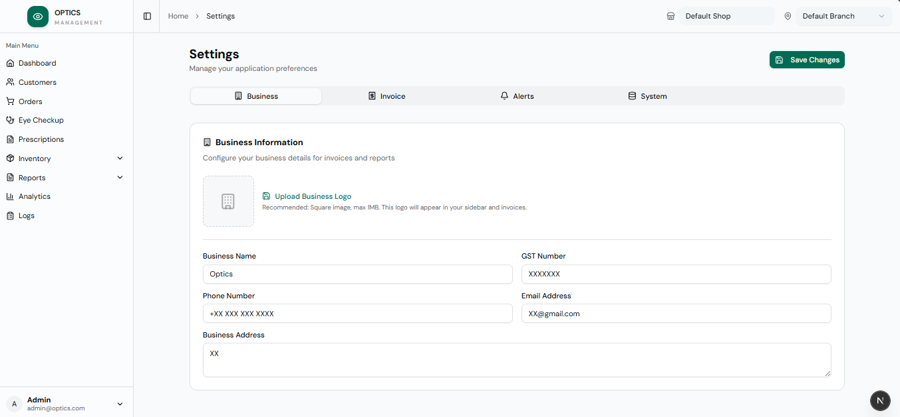

# 👓 Optics POS

A modern, full-featured **Point of Sale (POS) system** designed specifically for optical retail shops. Built with Next.js and React 19, this web application streamlines inventory management, sales tracking, customer management, and comprehensive reporting for eyewear businesses.

<p align="center">
  
  
  
  
  
</p>
<p align="center">
  
  
  
  
</p>

> **This is an online web application.** It runs on a Node.js server and is accessed through a browser. It is not a desktop app, Electron app, or offline-first PWA. An internet connection or local network access to the server is required.

---

## 📋 Table of Contents

- [Features](#-features)
- [Screenshots](#-screenshots)
- [Getting Started](#-getting-started)
- [Project Structure](#-project-structure)
- [Database Schema](#️-database-schema)
- [Tech Stack](#️-tech-stack)
- [API Reference](#-api-reference)
- [Configuration](#️-configuration)
- [Lens Fabrication Portal](#-lens-fabrication-portal)
- [Activity Logging](#-activity-logging)
- [Security](#-security)
- [Troubleshooting](#-troubleshooting)
- [Contact](#-contact)

---

## ✨ Features

### 📦 Inventory Management

| Feature | Description |
|---------|-------------|
| **Frames** | Manage eyeglass frames with brand, model, color, size, category (glasses/sunglasses), cost/price, barcode, and shape |
| **Spectacle Lenses** | Track lens inventory with type, material, coating, and detailed specifications |
| **Contact Lenses** | Full contact lens management with SPH, CYL, AXIS, base curve, diameter, water content, UV protection, and expiry tracking |
| **Accessories** | Manage optical accessories and supplies with categorization |
| **Brands** | Organize products by brand with type classification (Frame, Lens, Accessory, Service, Glass, Sunglasses, Contact Lens) |
| **Barcode Support** | All inventory items (frames, lenses, contact lenses, accessories) support barcode fields for scanner integration |
| **Stock Tracking** | Real-time inventory levels with configurable low-stock alerts on dashboard |
| **Opening Balance** | Track initial stock quantities for accurate reporting |
| **Stock In Hand** | Dedicated report for current inventory status with tabbed view (Frames, Lenses, Contact Lens, Accessories) |
| **Item Details Modal** | View full item details including specifications, stock, and available color/model variations |
| **Consistent Stock Alerts** | Unified low-stock and out-of-stock alerts across dashboard and Stock In Hand page |

### 💰 Sales & Orders

- **New Orders** - Create sales orders with multiple items (frames, lenses, accessories, services, eye checkups)
- **Barcode Scanner Integration** - Scan any product barcode on the order page to instantly add it to the order — no clicking required. Hardware USB/Bluetooth scanners are supported out of the box. Plays audio feedback (success, duplicate, error) and shows toast notifications
- **Prescription Support** - Full OD/OS prescription entry:
  - SPH, CYL, AXIS, ADD, PRISM
  - Pupillary Distance (PD) - Single or Dual mode
  - Diameter, Base Curve, Segment
- **Invoice Generation** - Professional invoice printing:
  - A4 format for standard printing (Laserjet layout)
  - 80mm thermal receipt format for quick printing
  - Clean print output without browser headers/footers
  - Proper display of shop name, branch details, GSTIN, and customer messages
- **Quick Eye Checkup** - One-click eye checkup order creation from main orders page
- **Discounts** - Apply percentage or fixed discounts at order level
- **Payment Tracking** - Track advance payments, balance due, and payment status
- **Role-Based Payment Fields** - Certain payment fields visible only to owner accounts
- **Order Status** - Track orders through: Pending → Ready → Delivered
- **Automatic Stock Deduction** - Inventory automatically updated on order creation
- **Order Types** - Glasses, Sunglasses, Contact Lenses, and custom order types

### 🛒 Purchases

- **Purchase Orders** - Manage supplier/vendor purchases with multi-item support
- **Cost Tracking** - Track purchase costs, discounts, taxes, and totals
- **Vendor Payments** - Monitor paid amounts and outstanding balances
- **Purchase History** - Complete purchase transaction records
- **Stock Addition** - Automatic stock updates on purchase entry

### 👥 Customer Management

- **Customer Profiles** - Store complete customer information:
  - First name, last name
  - Phone, mobile, email
  - Address
- **Prescription Records** - Maintain complete eye prescription history per customer
- **Load Latest RX** - Quickly load customer's latest prescription into new orders
- **Order History** - View all orders for each customer
- **Shop-Specific Customers** - Customers are isolated per shop for multi-tenancy
- **Quick Search** - Fast customer lookup with typeahead

### 🏪 Vendor Management

- **Vendor Profiles** - Comprehensive vendor records with:
  - Company name and contact person
  - Phone, email, address, city
  - GST and PAN numbers for tax compliance
- **Balance Tracking** - Monitor outstanding balances per vendor
- **Purchase History** - All purchases linked to vendors

### 📊 Reports & Analytics

| Report | Description |
|--------|-------------|
| **Sales Report** | Filter by date range, branch, customer, order type with export to Excel |
| **Purchases Report** | Track purchasing patterns and vendor transactions |
| **Collection Report** | Monitor payment collections and cash flow |
| **Receivable Report** | Track outstanding customer balances |
| **Item Ledger** | Detailed item-wise transaction history with stock movements |
| **Stock In Hand** | Current inventory levels across all product types |
| **Analytics Dashboard** | Visual insights with interactive area charts and statistics |

### 🏢 Multi-Shop & Multi-Branch Support

- **Multiple Shops** - Manage completely separate businesses/shops
- **Branches per Shop** - Each shop can have multiple branch locations
- **Data Isolation** - Complete data separation between shops
- **Branch-Specific Reporting** - Filter all reports by branch
- **Easy Switching** - Quick shop/branch selection from sidebar
- **Branch-Level Inventory** - Stock tracked per branch

### 👔 Super Admin Dashboard

- **Platform Overview** - View statistics across all shops (total shops, users, orders, customers)
- **Shop Management** - Create, edit, activate/deactivate shops
- **Branch Management** - Manage branches for each shop
- **User Accounts** - Create and manage user accounts with role assignment
- **User-Shop Assignment** - Assign users to specific shops and branches
- **Account Validity** - Set account expiration (permanent or time-limited)
- **7-Day Trial Accounts** - Create trial accounts with 7-day validity period
- **Extend Account Validity** - Extend expiration dates for existing accounts

### 🔬 Lens Fabrication Portal

- **Fabrication Job Queue** - Automatically create a fabrication job when an order contains frame or lens items
- **Job Statuses** - Track jobs through: Queued → In Progress → Done (or Flagged for issues)
- **Priority Levels** - Assign normal or urgent priority to jobs
- **Job Details** - Each job captures patient name, frame info, lens info, prescription data, optician notes, and fabricator notes
- **Flag & Notes** - Fabricators can flag jobs with a reason and add internal notes
- **Job History Logs** - Full audit trail of status changes per job with timestamps and user attribution
- **Dedicated Portal** - Lens fabricators access a clean, role-restricted portal at `/lens-fabricator`
- **Fabrication History** - Searchable history of all completed/flagged jobs with date filtering
- **Flagged Job Alerts** - Flagged fabrication jobs surface in the notification tray for quick attention
- **Shop & Branch Context** - Portal navbar shows current shop and branch

### 🔑 User Roles & Permissions

| Role | Access Level |
|------|--------------|
| **Super Admin** | Full platform access, manage all shops and users |
| **Admin** | Shop-level access, restricted to assigned shop/branch |
| **Staff** | Same app as Admin but without Reports, Analytics, Settings, Shifting between Branches and Logs |
| **Lens Fabricator** | Restricted portal access — view and update fabrication jobs only |

### 📋 Activity Logging

- **Change Tracking** - All create/update/delete operations are logged
- **User Attribution** - Track which user made each change
- **Change Details** - View old vs new values for updates, including brand and color for frame/lens items
- **Activity Alerts** - Dashboard notification when new logs exist (defaults to last 24 h on fresh install)
- **All-Time Count** - Shows total log count on first visit rather than just recent activity
- **Notification Tray** - Slide-out notification panel with adjustable width for viewing alerts and flagged fabrication jobs
- **Filterable Logs** - Filter by entity type, action, user, and date range
- **Audit Trail** - Complete audit history for compliance

### ⚙️ Settings & Customization

- **Business Profile** - Configure shop name, address, phone, email
- **Invoice Settings** - Customize invoice header, footer, and format
- **Currency** - Configurable currency symbol (default: PKR)
- **Tax Rate** - Configurable tax percentage
- **Date Format** - Customizable date display format
- **Low Stock Threshold** - Set when to trigger low stock alerts
- **Alert Mute Duration** - Control how long alerts stay dismissed
- **Creator PIN** - PIN protection for sensitive operations (branch creation)
- **Theme Support** - Dark/light mode theming with system preference detection

---

## 📸 Screenshots








---

## 🚀 Getting Started

### Prerequisites

- **Node.js** 18.0 or higher
- **npm** (comes with Node.js) or **yarn**

### Installation

1. **Clone the repository**
   ```bash
   git clone https://github.com/arslannafees/optics-pos.git
   cd optics-pos
   ```

2. **Install dependencies**
   ```bash
   npm install
   ```

3. **Run the development server**
   ```bash
   npm run dev
   ```

4. **Open your browser**
   Navigate to [http://localhost:3000](http://localhost:3000)

> The app runs as a **web server**. Keep the terminal running while using the app. Other devices on the same network can also access it via your machine's IP address and port 3000.

### Available Scripts

| Command | Description |
|---------|-------------|
| `npm run dev` | Start development server |
| `npm run build` | Build for production |
| `npm start` | Start production server |
| `npm run lint` | Run ESLint for code quality |

---

## 📁 Project Structure

```
optics-pos/
├── 📂 src/
│   ├── 📂 app/                      # Next.js App Router
│   │   ├── 📂 api/                  # Backend API routes (19 route groups)
│   │   │   ├── activity-logs/       # Activity logging API
│   │   │   ├── analytics/           # Analytics data
│   │   │   ├── branches/            # Branch management
│   │   │   ├── fabrication/         # Lens fabrication jobs API
│   │   │   ├── brands/              # Brand CRUD
│   │   │   ├── contact-lenses/      # Contact lens CRUD
│   │   │   ├── customers/           # Customer CRUD + prescriptions
│   │   │   ├── dashboard/           # Dashboard stats
│   │   │   ├── frames/              # Frame CRUD
│   │   │   ├── login/               # Authentication
│   │   │   ├── orders/              # Order CRUD + items
│   │   │   ├── profile/             # User profile
│   │   │   ├── purchases/           # Purchase CRUD
│   │   │   ├── reports/             # Reports API (sales, purchases, collection, receivable)
│   │   │   ├── settings/            # App settings
│   │   │   ├── spectacle-lenses/    # Spectacle lens CRUD
│   │   │   ├── super-admin/         # Super admin APIs (shops, branches, users, stats)
│   │   │   ├── vendors/             # Vendor CRUD
│   │   │   └── verify-creator/      # Creator PIN verification
│   │   │
│   │   ├── 📂 [Frontend Pages]
│   │   │   ├── page.jsx             # Dashboard (main page)
│   │   │   ├── login/               # Login page
│   │   │   ├── order/               # Orders (list, new, [id] view/edit)
│   │   │   ├── customer/            # Customer management
│   │   │   ├── frame/               # Frame inventory
│   │   │   ├── spectacle-lenses/    # Spectacle lens inventory
│   │   │   ├── contact-lenses/      # Contact lens inventory
│   │   │   ├── accessories/         # Accessories inventory
│   │   │   ├── brands/              # Brand management
│   │   │   ├── vendor/              # Vendor management
│   │   │   ├── purchases/           # Purchase orders
│   │   │   ├── prescriptions/       # Prescriptions list & printing
│   │   │   ├── reports/             # Reports (sales, purchases, collection, receivable, item-ledger)
│   │   │   ├── analytics/           # Analytics dashboard
│   │   │   ├── logs/                # Activity logs viewer
│   │   │   ├── settings/            # Shop settings
│   │   │   ├── profile/             # User profile
│   │   │   ├── stock-in-hand/       # Stock report
│   │   │   ├── item-ledger/         # Item ledger page
│   │   │   ├── super-admin/         # Super admin dashboard (shops, branches, accounts, settings)
│   │   │   └── lens-fabricator/     # Lens fabricator portal (jobs, [id] detail, history)
│   │   │
│   │   ├── globals.css              # Global styles & Tailwind imports
│   │   └── layout.js                # Root layout with providers
│   │
│   ├── 📂 components/               # Reusable React components
│   │   ├── app-layout.jsx           # Main app shell with sidebar & navigation
│   │   ├── AlertsMarquee.jsx        # Low stock alerts marquee
│   │   ├── ContactLensIcon.jsx      # Custom SVG icon for contact lenses
│   │   ├── DeleteConfirmationModal.jsx  # Reusable delete confirmation
│   │   ├── NoData.js                # Empty state component
│   │   └── 📂 ui/                   # 29 shadcn/ui components
│   │       ├── button.jsx           # Button variants
│   │       ├── input.jsx            # Form inputs
│   │       ├── select.jsx           # Dropdown selects
│   │       ├── dialog.jsx           # Modal dialogs
│   │       ├── card.jsx             # Card containers
│   │       ├── table.jsx            # Data tables
│   │       ├── data-table.jsx       # Advanced data table with sorting/filtering
│   │       ├── calendar.jsx         # Date picker calendar
│   │       ├── date-picker.jsx      # Date picker component
│   │       ├── chart.jsx            # Chart components
│   │       ├── sidebar.jsx          # Collapsible sidebar
│   │       ├── stats-card.jsx       # Dashboard stats cards
│   │       └── ... (16 more)
│   │
│   ├── 📂 contexts/                 # React Context providers
│   │   ├── BranchContext.js         # Shop/Branch selection & multi-tenancy
│   │   └── SettingsContext.js       # App settings state
│   │
│   ├── 📂 hooks/                    # Custom React hooks (47 total)
│   │   ├── useBarcodeScanner.js     # Hardware barcode scanner input detection
│   │   ├── useOrderMutations.js     # Order item add/remove/scan logic
│   │   └── ...                      # Order, inventory, report, admin hooks
│   │
│   └── 📂 lib/                      # Utilities & database
│       ├── db.js                    # SQLite database schema & connection
│       ├── log-activity.js          # Activity logging utility
│       ├── orderSettings.js         # Order form field configuration
│       ├── prescriptionSettings.js  # Prescription field configuration
│       └── utils.js                 # Helper functions (cn, formatDate)
│
├── 📂 data/                         # SQLite database storage
│   └── optics.db                    # Main database (auto-created on first run)
│
├── 📂 public/                       # Static assets
│   └── Images/
│       └── no-data.png              # Empty state image
│
├── package.json                     # Dependencies & scripts
├── next.config.mjs                  # Next.js configuration
├── tailwind.config.js               # Tailwind CSS configuration
├── components.json                  # shadcn/ui configuration
└── README.md                        # This file
```

---

## 🗄️ Database Schema

The application uses **SQLite** (via better-sqlite3) with **18 tables** for complete data management. The database is automatically created on first run with all migrations applied.

### Core Tables

| Table | Purpose | Key Fields |
|-------|---------|------------|
| `shops` | Multi-tenant shop management | id, name, slug, active |
| `branches` | Shop branch locations | id, shop_id, name, address, phone |
| `users` | User accounts with roles | id, name, email, password, role, shop_id, branch_id, expires_at |
| `customers` | Customer records per shop | id, shop_id, first_name, last_name, phone, mobile, email, address |
| `settings` | Per-shop configuration | id, shop_id, key, value |

### Inventory Tables

| Table | Purpose | Key Fields |
|-------|---------|------------|
| `brands` | Product brands | id, name, type, shop_id, branch_id |
| `frames` | Eyeglass frames | id, brand_id, model, category, size, color, cost, price, stock, barcode |
| `lenses` | Spectacle lenses | id, brand_id, name, type, material, coating, cost, price, stock, barcode |
| `contact_lenses` | Contact lenses | id, brand_id, name, type, base_curve, diameter, sph, cyl, axis, expiry_date, barcode |
| `accessories` | Optical accessories | id, brand_id, name, accessory_type, cost, price, stock, barcode |
| `vendors` | Supplier records | id, shop_id, name, company, contact_person, phone, balance |

### Transaction Tables

| Table | Purpose | Key Fields |
|-------|---------|------------|
| `orders` | Sales orders | id, shop_id, branch_id, customer_id, order_type, status, total, advance, balance |
| `order_items` | Order line items | id, order_id, item_type, item_id, item_name, quantity, price, total |
| `purchases` | Vendor purchases | id, shop_id, branch_id, vendor_id, invoice_number, total, paid, balance |
| `purchase_items` | Purchase line items | id, purchase_id, item_type, item_id, quantity, cost, total |
| `prescriptions` | Eye prescriptions | id, order_id, customer_id, right_*, left_*, pd_type, total_pd |
| `activity_logs` | Audit trail | id, shop_id, user_id, action, entity_type, entity_id, changes, created_at |
| `fabrication_jobs` | Lens fabrication queue | id, order_id, shop_id, branch_id, status, priority, patient_name, frame_info, lens_info, prescription_data, optician_notes, fabricator_notes, flag_reason |
| `fabrication_job_logs` | Fabrication status history | id, job_id, status, note, updated_by, updated_by_name, created_at |

### Supported Item Types

Order and purchase items support the following types:
- `glass` - Eyeglasses
- `sunglasses` - Sunglasses
- `lens` - Spectacle lenses
- `contact_lens` - Contact lenses
- `accessory` - Accessories
- `service` - Services
- `frame` - Frames only
- `eye_checkup` - Eye examination

---

## 🛠️ Tech Stack

### Core Framework

| Technology | Version | Purpose |
|------------|---------|---------|
| **Next.js** | 16.1.6 | React framework with App Router |
| **React** | 19.1.0 | UI library with latest concurrent features |
| **TailwindCSS** | 4.0 | Utility-first CSS framework |
| **SQLite** | better-sqlite3 12.5 | Embedded database via Node.js server |

### UI Components

| Technology | Version | Purpose |
|------------|---------|---------|
| **Radix UI** | Latest | Accessible, unstyled UI primitives |
| **shadcn/ui** | - | Pre-built component library based on Radix |
| **Lucide React** | 0.539 | Modern, consistent icon library |
| **Recharts** | 2.15 | Data visualization charts |
| **cmdk** | 1.1 | Command menu / search palette |
| **react-day-picker** | 8.10 | Accessible date picker for calendars |
| **@tanstack/react-table** | 8.21 | Headless data table with sorting/filtering |

### Utilities

| Technology | Version | Purpose |
|------------|---------|---------|
| **date-fns** | 4.1 | Date formatting & manipulation |
| **jsPDF** | 4.0 | PDF generation for invoices |
| **jspdf-autotable** | 5.0 | Table generation in PDFs |
| **html-to-image** | 1.11 | Screenshot/image generation |
| **xlsx** | 0.18 | Excel export functionality |

### Authentication & Security

| Technology | Version | Purpose |
|------------|---------|---------|
| **bcryptjs** | 3.0 | Password hashing |
| **jsonwebtoken** | 9.0 | JWT authentication tokens |

### Developer Experience

| Technology | Version | Purpose |
|------------|---------|---------|
| **next-themes** | 0.4 | Theme management (dark/light) |
| **sonner** | 2.0 | Toast notifications |
| **tw-animate-css** | 1.3 | Tailwind animation utilities |

---

## 🌐 API Reference

All API routes are located in `src/app/api/` and require authentication via JWT token (except `/api/login`).

### Authentication

| Method | Endpoint | Description |
|--------|----------|-------------|
| `POST` | `/api/login` | User login, returns JWT token |
| `GET` | `/api/profile` | Get current user profile |

### Inventory Management

| Method | Endpoint | Description |
|--------|----------|-------------|
| `GET/POST` | `/api/frames` | List/create frames |
| `GET/PUT/DELETE` | `/api/frames/[id]` | Get/update/delete frame |
| `GET/POST` | `/api/spectacle-lenses` | List/create spectacle lenses |
| `GET/PUT/DELETE` | `/api/spectacle-lenses/[id]` | Get/update/delete lens |
| `GET/POST` | `/api/contact-lenses` | List/create contact lenses |
| `GET/PUT/DELETE` | `/api/contact-lenses/[id]` | Get/update/delete contact lens |
| `GET/POST` | `/api/accessories` | List/create accessories |
| `GET/PUT/DELETE` | `/api/accessories/[id]` | Get/update/delete accessory |
| `GET/POST` | `/api/brands` | List/create brands |
| `GET/PUT/DELETE` | `/api/brands/[id]` | Get/update/delete brand |

### Transactions

| Method | Endpoint | Description |
|--------|----------|-------------|
| `GET/POST` | `/api/orders` | List/create orders |
| `GET/PUT/DELETE` | `/api/orders/[id]` | Get/update/delete order |
| `GET/POST` | `/api/purchases` | List/create purchases |
| `GET/PUT/DELETE` | `/api/purchases/[id]` | Get/update/delete purchase |
| `GET/POST` | `/api/customers` | List/create customers |
| `GET/PUT/DELETE` | `/api/customers/[id]` | Get/update/delete customer |
| `GET` | `/api/customers/[id]/prescriptions` | Get customer's prescription history |
| `GET/POST` | `/api/vendors` | List/create vendors |
| `GET/PUT/DELETE` | `/api/vendors/[id]` | Get/update/delete vendor |

### Reports & Analytics

| Method | Endpoint | Description |
|--------|----------|-------------|
| `GET` | `/api/dashboard` | Dashboard statistics |
| `GET` | `/api/analytics` | Analytics data for charts |
| `GET` | `/api/reports/sales` | Sales report data |
| `GET` | `/api/reports/purchases` | Purchase report data |
| `GET` | `/api/reports/collection` | Collection report data |
| `GET` | `/api/reports/receivable` | Receivable report data |

### Lens Fabrication

| Method | Endpoint | Description |
|--------|----------|-------------|
| `GET/POST` | `/api/fabrication` | List/create fabrication jobs |
| `GET/PUT` | `/api/fabrication/[id]` | Get/update fabrication job (status, notes, flag) |
| `GET` | `/api/fabrication/stats` | Fabrication job counts by status |

### Activity Logs

| Method | Endpoint | Description |
|--------|----------|-------------|
| `GET` | `/api/activity-logs` | List activity logs with pagination |
| `DELETE` | `/api/activity-logs` | Clear all activity logs |

### Super Admin (requires super-admin role)

| Method | Endpoint | Description |
|--------|----------|-------------|
| `GET/POST` | `/api/super-admin/shops` | List/create shops |
| `GET/PUT/DELETE` | `/api/super-admin/shops/[id]` | Get/update/delete shop |
| `GET/POST` | `/api/super-admin/branches` | List/create branches |
| `GET/PUT/DELETE` | `/api/super-admin/branches/[id]` | Get/update/delete branch |
| `GET/POST` | `/api/super-admin/users` | List/create users |
| `GET/PUT/DELETE` | `/api/super-admin/users/[id]` | Get/update/delete user |
| `GET` | `/api/super-admin/stats` | Platform-wide statistics |

### Other

| Method | Endpoint | Description |
|--------|----------|-------------|
| `GET/PUT` | `/api/settings` | Get/update shop settings |
| `GET/POST` | `/api/branches` | Branch operations |
| `POST` | `/api/verify-creator` | Verify creator PIN |

---

## ⚙️ Configuration

### Settings (per shop)

Settings are stored in the `settings` table with the following keys:

| Key | Default | Description |
|-----|---------|-------------|
| `currency` | PKR | Currency symbol displayed throughout app |
| `taxRate` | 18 | Tax percentage for calculations |
| `dateFormat` | DD/MM/YYYY | Date display format |
| `invoicePrefix` | INV | Prefix for invoice numbers |
| `invoiceStartNumber` | 1 | Starting invoice number |
| `lowStockThreshold` | 5 | When to trigger low stock alerts |
| `lowStockAlert` | true | Enable/disable low stock notifications |
| `printerType` | laserjet | Default printer type (laserjet/thermal) |
| `businessName` | - | Business name on invoices |
| `businessAddress` | - | Business address on invoices |
| `businessPhone` | - | Business phone on invoices |
| `businessEmail` | - | Business email on invoices |
| `emailNotifications` | false | Enable dashboard alerts |
| `alertMuteDuration` | session | How long alerts stay dismissed |
| `creator_pin` | - | PIN for protected operations |

### Environment

No environment variables are required. The app connects to a local SQLite database at `data/optics.db` which is auto-created on first run.

---

## 📝 Activity Logging

The system automatically logs all significant actions:

### Tracked Actions

| Action | Description |
|--------|-------------|
| `create` | New record created |
| `update` | Existing record modified |
| `delete` | Record deleted |

### Tracked Entities

- Customers, Orders, Prescriptions
- Frames, Lenses, Contact Lenses, Accessories
- Brands, Vendors, Purchases

### Log Data Captured

- **User info** - Name, role, ID
- **Shop/Branch** - Where action occurred
- **Entity details** - Type, ID, name
- **Changes** - JSON with old and new values for updates
- **Timestamp** - When action occurred (UTC)

### Dashboard Alert

When the owner logs in, they see a notification if new activity logs exist since their last login.

---

## 🔐 Security

| Feature | Implementation |
|---------|----------------|
| **Password Hashing** | bcryptjs with salt rounds (10) |
| **JWT Authentication** | Token-based auth stored in localStorage |
| **Protected Routes** | All API routes require valid JWT |
| **Role-Based Access** | Super Admin vs Admin restrictions |
| **Shop/Branch Isolation** | Users only access their assigned data |
| **Data Isolation** | All queries filtered by shop_id/branch_id |
| **PIN Protection** | Creator PIN for sensitive operations |
| **Foreign Key Constraints** | Database-level referential integrity |
| **ON DELETE CASCADE** | Automatic cleanup of related records |
| **WAL Mode** | Database write-ahead logging for reliability |

### Authentication Flow

1. User submits email/password to `/api/login`
2. Password verified with bcrypt comparison
3. JWT token generated with user data
4. Token returned to client, stored in localStorage
5. All subsequent requests include `Authorization: Bearer <token>` header
6. API routes extract and verify token before processing

---

## 🔧 Troubleshooting

### Common Issues

**Database locked error**
```bash
# Stop all Node processes and restart
taskkill /f /im node.exe  # Windows
npm run dev
```

**Port 3000 already in use**
```bash
# Kill process on port 3000
npx kill-port 3000
npm run dev
```

**Missing modules after git pull**
```bash
npm install
```

**Database not found**
- Database is auto-created on first run at `data/optics.db`
- Ensure `data/` directory has write permissions

### Reset Database

To start fresh, delete the database files:
```bash
rm data/optics.db
rm data/optics.db-shm  # if exists
rm data/optics.db-wal  # if exists
npm run dev
```

---

## 🤝 Contributing

This is a private project. For any inquiries, please contact the project maintainer.

---

## 📞 Contact

   👤 Name: Arslan Nafees<br>
   📱 Phone: +92 334 111 3047
📧 Email: arslannafees807@gmail.com
[](https://github.com/arslannafees)

---

## 📄 License

This project is proprietary and confidential. Unauthorized copying, distribution, or use is strictly prohibited.

```
Copyright (c) 2026 Arslan Nafees
All rights reserved.
```

---

<p align="center">
  Made for optical retail businesses<br/>
  <sub>Powered by Next.js, React, and SQLite</sub>
</p>
